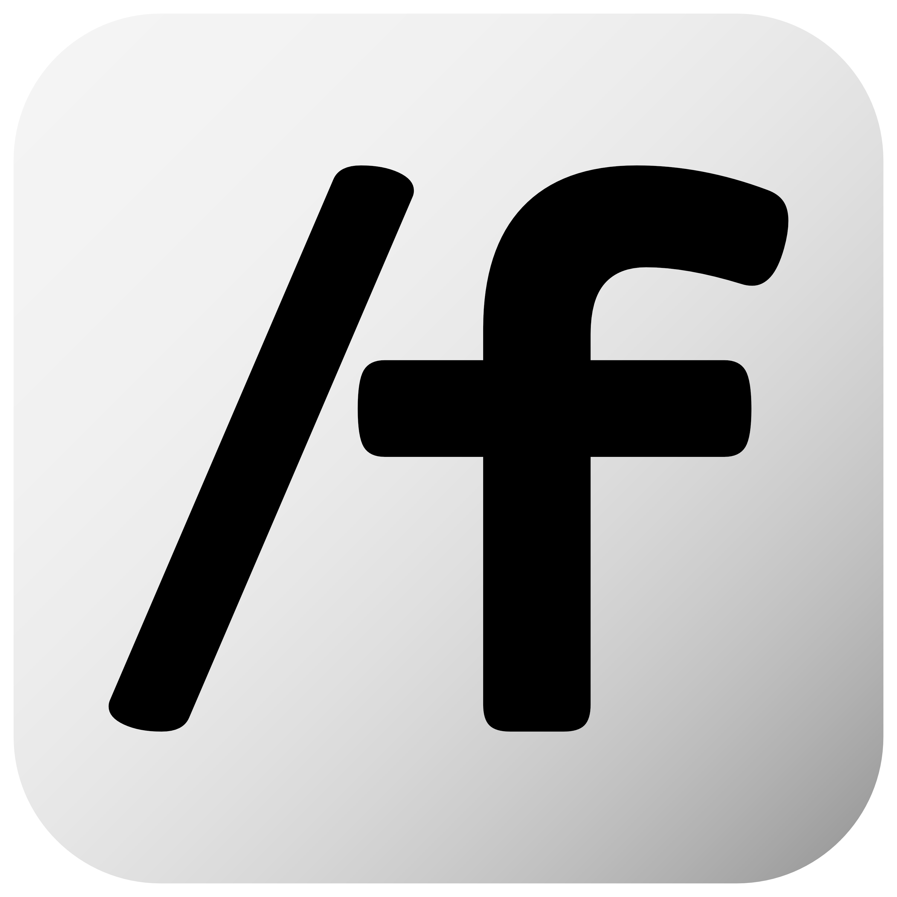

<p align="center">
  
  <br>
  <b>FOUNT</b>
  <br>
  <i>Blockbusters in Terminal</i>
</p>

# Fount
**Fount** is a minimal, distraction-free Fountain screenplay editor built for writers who live in the terminal. It blends the raw efficiency of Rust with a "Zen Studio" aesthetic, providing a writing experience that feels professional, focused, and deeply personal.

---

## 🚀 Installation

### Linux
- **Arch Linux (AUR)**:
  ```bash
  yay -S fount-bin
  ```
- **Debian / Ubuntu**: Download the latest `.deb` package from the [Releases](https://github.com/BeetleBot/FountTUI/releases) page.
- **Fedora / RHEL**: Download the latest `.rpm` package from the [Releases](https://github.com/BeetleBot/FountTUI/releases) page.

### Any Platform (via Cargo)
```bash
cargo install fount
```

### Windows
<a href="https://apps.microsoft.com/detail/9nz3hv7n30s2?hl=en-US&gl=IN">
  
</a>

### macOS
- **Cargo**: `cargo install fount` (for best results, use a terminal with Truecolor support like iTerm2 or Ghostty)

---

## ✍️ Developer's Note

> [!NOTE]
> **A Letter from the Creator**
> 
> As a credited Tamil/Indian screenwriter—writing predominantly in **English and Tanglish**—I found myself at a crossroads when I transitioned to Linux. I deeply missed **[Beat](https://github.com/lmparppei/Beat)**, my long-time companion for storytelling, and couldn't find a minimalist alternative that felt "right" in the terminal.
> 
> My search led me to **[Lottie](https://github.com/coignard/lottie)**, whose elegance immediately captivated me. I cloned the project and began shaping it into the tool I needed. While I possess a moderate grasp of Rust, this journey was significantly smoothed by the partnership of **AI Agents like Claude and Gemini**. They were instrumental in helping me overcome technical hurdles, complicated logic, and the often frustrating nuances of software release workflows. Fount is the result of my creative vision and writing background, the open-source code that inspired me, and the intelligence of the agents that helped me build it. It is a tool I use daily, and I hope it serves you just as well.

> [!IMPORTANT]
> **A Note on Pagination**
> Due to TUI constraints, page counts shown in the editor are only approximate. Layouts for A4 and US Letter may have up to a +/- 2 pages difference in the TUI view. The TUI pagination is an approximation; only the final export contains the true, definitive page count.

---

## ✨ Feature Showcase

Fount is a dedicated writing environment designed to disappear while you work.

### 🏠 Homescreen Dashboard
A walkthrough of the beautiful homescreen dashboard in Fount, showing recent screenplay files and quick actions.
[](https://asciinema.org/a/1076515)

---

### 🗺️ Outline & Structures
Import structural templates (e.g. Hero's Journey, 3-Act Structure) directly into FountTUI to scaffold a screenplay outline instantly.
[](https://asciinema.org/a/1076516)

---

### 🃏 Story Architect (Index Cards View & Scene Editing)
Plot your story at a high level using the grid-based index cards to organize and edit scene synopses with smooth word-wrap.
[](https://asciinema.org/a/1076517)

---

### 🌲 Scene Tree Navigation
Interactive side-panel and tree-structured view of scenes and sequences inside the screenplay, with instant search and jump.
[](https://asciinema.org/a/1076518)

---

### ⚡ Smart Screenplay Elements
Demonstrating Fount's smart autocomplete, automatic character/parenthetical centering, and contextual element wrapping.
[](https://asciinema.org/a/1076519)

---

### ⏱️ Automated Session Snapshots
Under the hood look at Fount's background snapshotting system that periodically auto-saves buffer states to prevent data loss.
[](https://asciinema.org/a/1076520)

---

### 📝 Fountain Syntax Markup Syntax
Live editing showcasing bold, italic, underlined, lyrics, centered text, and inline notes syntax rendering in FountTUI.
[](https://asciinema.org/a/1076522)

---

### 🎨 Theme Customisation
Cycle through curated themes like **Catppuccin**, **Nord**, **Everforest**, and the new **Lilac** to suit your mood.
[](https://asciinema.org/a/1076523)

---

### 📊 Xray Mode
Visualize your screenplay's pacing, character frequency, and scene length distribution in real-time using X-Ray mode.
[](https://asciinema.org/a/1076524)

---

## 🏛️ Inspiration & Credits

Fount stands on the shoulders of giants. This project would not have been possible without the inspiration and foundational work of the following:

1.  **[Lottie](https://github.com/coignard/lottie)**: My immediate inspiration. Fount began as a fork and evolution of this beautiful terminal editor.
2.  **[Beat](https://github.com/lmparppei/Beat)**: The gold standard for minimalist screenwriting software. Fount is my attempt to bring the spirit of Beat to the Linux terminal.
3.  **[Fountain.io](https://github.com/nyousefi/Fountain)**: The universal screenplay format that powers modern independent screenwriting.

> [!IMPORTANT]
> A massive thank you to the creators of these tools. Their commitment to the craft of writing and software design continues to inspire creators worldwide.
